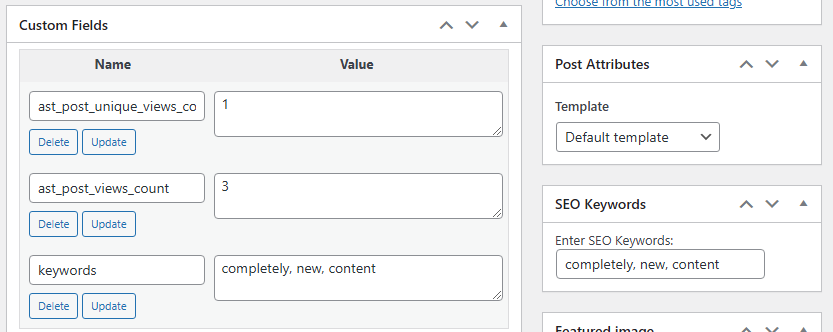

# Advanced SEO Toolkit

A comprehensive SEO toolkit for WordPress, designed to enhance your site's visibility on search engines. This plugin includes features such as schema markup, keyword tracking, meta tags customization, and more.

## Table of Contents

- [Features](#features)
- [Installation](#installation)
- [Usage](#usage)
- [Configuration](#configuration)
- [Contributing](#contributing)
- [Changelog](#changelog)
- [License](#license)

## Features

## Features

- **SEO Analytics Dashboard:** Monitor your SEO metrics easily.
  

- **Detailed Post Views Tracking:** Track total and unique views for each post.
  

- **Customizable Meta Tags:** Add dynamic meta tags for improved SEO.
  

  
- **Dynamic Meta Tags**: Automatically generate meta descriptions and keywords based on post content.
- **Schema Markup**: Includes JSON-LD schema for improved SEO.
- **SEO Analytics Dashboard**: View post views, unique views, and SEO-related data directly in the WordPress dashboard.
- **Open Graph and Twitter Card Support**: Easily add social media tags for better content sharing.
- **Customizable via Screen Options**: Toggle columns visibility and pagination settings in the analytics dashboard.
- **Sitemap Generation**: Automatically generate a sitemap when new posts are published.
- **Unique View Tracking**: Track total and unique post views.

## Installation

1. **Download the Plugin**: Clone this repository or download the ZIP file.
2. **Upload to WordPress**: Upload the plugin files to your WordPress `/wp-content/plugins/` directory, or install directly through the WordPress plugins screen.
3. **Activate**: Activate the plugin through the 'Plugins' screen in WordPress.
4. **Configuration**: Go to the "SEO Analytics" menu in your WordPress admin dashboard to start configuring the plugin.

## Usage

Once activated, the plugin automatically adds meta tags, schema markup, and Open Graph/Twitter Card tags to your posts and pages. You can view and manage SEO-related data from the "SEO Analytics" page in the WordPress admin.

### SEO Analytics Dashboard

1. Navigate to **SEO Analytics** from the WordPress admin sidebar.
2. View detailed analytics for each post, including total views, unique views, keywords, meta descriptions, Open Graph titles, and Twitter titles.
3. Customize the columns you want to display by using the **Screen Options** at the top-right corner.

## Configuration

- **Meta Tags**: Automatically generated based on post content, but can be customized using meta boxes in the post editor.
- **Schema Markup**: Automatically included for single posts.
- **Sitemap**: Generated on publishing a post.

### Custom Meta Tags

For each post, you can enter custom keywords through the SEO meta box available in the post editor.

### Screen Options

- Adjust how many posts to display per page.
- Toggle visibility of columns in the SEO Analytics table.

## Contributing

Contributions are welcome! Here's how you can help:

1. **Fork the Repository**: Make your changes on a new branch.
2. **Submit a Pull Request**: Describe the changes you have made and submit a pull request for review.
3. **Report Issues**: If you find a bug, please create an issue with detailed steps to reproduce.

## Changelog

### Version 1.1
- Added support for unique views tracking.
- Improved SEO Analytics dashboard with sortable and toggleable columns.

### Version 1.0
- Initial release with dynamic meta tags, schema markup, and Open Graph support.

## License

This project is licensed under the MIT License. See the [LICENSE](./LICENSE) file for details.
